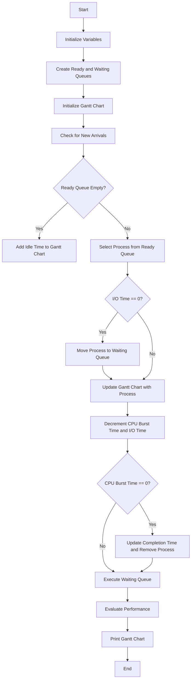

## 1. FCFS (First-Come, First-Served) Scheduling

```mermaid
graph TD
    A[Start] --> B[Initialize Variables]
    B --> C[Create Ready and Waiting Queues]
    C --> D[Initialize Gantt Chart]
    D --> E[Check for New Arrivals]
    E --> F{Ready Queue Empty?}
    F -- Yes --> G[Add Idle Time to Gantt Chart]
    F -- No --> H[Select Process from Ready Queue]
    H --> I{I/O Time == 0?}
    I -- Yes --> J[Move Process to Waiting Queue]
    J --> K[Update Gantt Chart with Process]
    I -- No --> K[Update Gantt Chart with Process]
    K --> L[Decrement CPU Burst Time and I/O Time]
    L --> M{CPU Burst Time == 0?}
    M -- Yes --> N[Update Completion Time and Remove Process]
    M -- No --> O[Execute Waiting Queue]
    N --> O[Execute Waiting Queue]
    O --> P[Evaluate Performance]
    P --> Q[Print Gantt Chart]
    Q --> R[End]
```
